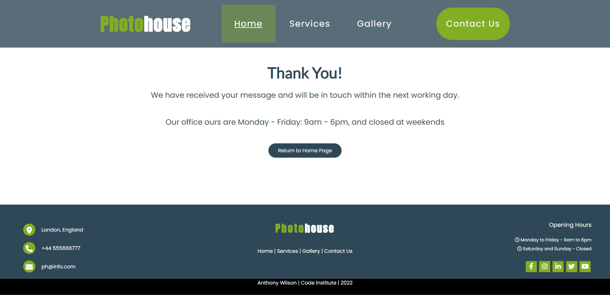

# Photohouse - HTML & CSS Website

# Introduction
This project is a Front End website for Photohouse, a marketing company based in London, England, that works with estate agents to provide photographs, floorplans and Energy Performance Certificates (EPCs) on properties they are contracted to sell or let. The main purpose of the website is to raise brand awareness, promote quality of services offered and increase the number of potential new business leads for the company. Intended users are estate agents and homeowners so UX has been designed to create a feeling of professionalism and approachability with focus set on quality of services offered. 

The website uses HTML and CSS code only, and is interactive, provides constant feedback to the user, is based on UX experience design and is fully accessible and responsive down to 280px. 

[Live Website Here](https://tonywilson1211.github.io/P1_Photohouse/)

# README Contents

    Expand

* [Introduction](#introduction)
* [User Experience (UX)](#user-experience)
    * [User stories](#user-stories)
* [Design](#design)
    * [Initial Design - Wireframe](#initial-concept---wire-frames)
    * [Website Structure](#website-structure)
    * [Colour Scheme](#colour-scheme)
    * [Typography](#typography)
    * [Imagery](#imagery)
    * [Google Maps](#google-maps)
    * [Interactive Links](#interactive-links) 
* [Existing Features](#existing-features)
    * [Landing Page](#landing-page)
    * [Navigation Bar](#navigation-bar)
    * [About Section](#about-section)
    * [Services Section](#services-section)
    * [Gallery Section](#gallery-section)
    * [Contact Us Section](#contact-us-section)
    * [Favicon](#favicon)
    * [Thank You Page](#thank-you-page)
    * [Footer Section](#footer-section)
    * [404 Error](#404-page)
* [Future Features](#future-features)
* [Technologies Used](#technologies-used)
* [Testing](#testing)
    * [Responsiveness](#responsiveness)
    * [Validators](#validators)
    * [Lighthouse](#lighthouse)
    * [Functional Testing](#functional-testing)
    * [Bugs](#bugs)
    * [Website Development Issues](#website-development-issues)
* [Deployment](#deployment-this-project)
    * [Deployment This Project](#deployment-this-project)
    * [Forking This Project](#forking-this-project)
    * [Cloning This Project](#cloning-this-project)
* [Credits](#credits)
* [Content](#content)

## User Experience

 ### User Stories

* As a website creator, I want to:
  
1. Build a website that is visually appealing from the user’s first visit so they are intrigued to explore all the pages and contact the company for more details.
2. Build an easy to navigate website for its users.
   
* As a new visitor, I want to:

1. Understand the main purpose of the site.
2. Be able to easily navigate throughout the site and find relevant content about services provided.
3. Be able to easily contact the company for more information.
   
* As a returning visitor, I want to:

1. Review quality of services available
2. Obtain contact information and/or easily send a message to the company.
   
## Design

### Initial Concept - Wire Frames
* The vast majority of the initial design concept was followed with only a few alterations either due to an aspect not being required (e.g additional 'contact us' button on services page at bottom, map within footer) or to timely to install (e.g chatbox  on contact us page) 

Expand

 
 
 

### Website Structure
* Photohouse website consists of four main pages: Home Page, Services Page, Gallery Page and Contact Us Page. 
* Two additional pages exist (1) Form submission confirmation (Thank You Page) (2) 404 Page.
* The Home Page has 6 sections: (1) Hero image and cover text, (2) About, (3) Services Overview, (4) Contact Us Button, (5) Gallery Overview, (6) Footer. 
* The Services Page has 3 sections: (1) Photography, with link to Gallery Page (2) Floorplans, with link to Contact Us Page, (3) EPCs, with link to Contact Us Page.
* The Gallery Page has 4 sections: (1) Residential photography (2) Lifestyle photography (3) Twilight photography (4) Drone Photography.
* The Contact Us Page has 3 sections: (1) Message form (2) company Contact Details (3) Map showing company location.
* All pages have a link to all the pages in the website via the fixed Navigation Bar (at the top of the users screen), and the footer section (at the bottom of each page). 

### Colour Scheme
* There are three main colours used: (1) white (#fff), (2) green (#82AF21), (3) dark blue (#2F4858). Each colour is used for various roles throughout the website in order maintain a fresh appearance through creativity whilst remaining consistent so as not to become random or chaotic.
* In the Services Section on the Home Page the user will see a linear gradient as the background using the six colours in the same generic gradient as the green (#82AF21) and dark blue (#2F4858) at 158 degrees.
* All colours match the hero image on the Home Page in order to create the sense of intention and consideration, as well as attention to detail which is a nod to the company's about section. 
 

### Typography
* The Anton, sans-serif is used for the company logo. Chosen for being bold and hard to miss.
* The Lato, sans-serif is used for section headings. Chosen for being ideal when used as a large font size without being overbearing.
* The Dancing Script, sans-serif is used to display either quotes or less important headings. Chosen for adding a sense of 'personal touch' thus cultivating a feeling of attention to detail, passion and approachability. 
* The Poppins, sans-serif is used as the main font for the whole website. Chosen for being easy to read. 
 
 

         
### Imagery
* Hero image chosen to convey quality, care and attention, warmth and modern styling. All qualities the company wishes to associate with. The image is also a good example of the quality of work the company can produce.
* 4 images are used in the Gallery Section of the Home Page to symbolise a style of photography, residential, lifestyle, twilight and drone. 
* 2 images are used in the Contact Us Section of the Home Page which are fixed in place whilst the user is scrolling. Images change at screen-width 800px to better suit the device. 
* All images converted to the webp files apart from those in the readme.md file.

### Google Maps
* The web site has a Google Maps location section where the users can locate the office in London.

### Interactive Links  

* At the bottom of each page inside the Footer Section and again on the Contact Us Page, users can access the company social media links. Once these icons are clicked they are opened in a new tab. 
* In the Footer Section and Contact Us Page, users can click on the company email address to send an email. 

## Existing Features

### Landing Page 

* The Landing Page is the first contact that users have with the website. A large hero image covers the user's screen and acts as a hook to intrigue the user to explore the site whilst already having an installed perception of quality. 
* It also features text used to deliver a marketing slogan to retain the users engagement and quickly provide context of what the company offers. 
[Live Page Here](https://tonywilson1211.github.io/P1_Photohouse/) 

### Navigation Bar

* At the top of the user's screen, users can find a fixed navigation bar that is fully responsive in all devices. 
* The navigation bar is fixed to the top of the screen making for easy and fast navigation of the website should the user be wanting to quickly skim the website. 
* A bold 'contact us' call to action button is located on the right side and the Photohouse logo on the left side. 
[Live Feature Here](https://tonywilson1211.github.io/P1_Photohouse/) 

### About Section

* The about section offers information on the company's main purpose, it's history and mission statement. 
[Live Feature Here](https://tonywilson1211.github.io/P1_Photohouse/index.html#about) 

### Services Section

* The services section on the Home Page offers a brief overview of the services provided by the company. 
* This is a quick reference point and clickable navigation links under each service takes the user to the services page where further information is provided on the product the user is most interested in. 
* On the services page, further clickable navigation links are available that provide access to the gallery page or the contact us page. Fluidity and ease of use for UX is kept in mind here.  
[Services Section On Home Page - Live Feature Here](https://tonywilson1211.github.io/P1_Photohouse/index.html#services) 
[Services Page - Live Feature Here](https://tonywilson1211.github.io/P1_Photohouse/index.html#services) 
 
[Services Page - Live Feature Here](https://tonywilson1211.github.io/P1_Photohouse/index.html#services) 

### Gallery Section

* The gallery section on the home page offers a brief overview of the type of photography provided by the company.
* Hover elements over each image draw the user to navigate to the gallery page where they will find a greater range of images.
* On the gallery page users can hover over images to increase the scale, providing a zoom-like effect.
* All photos are chosen to illustrate the quality of the service provided and fill the user with confidence in the company's ability to deliver high standards. 
[Gallery Section On Home Page - Live Feature Here](https://tonywilson1211.github.io/P1_Photohouse/index.html#gallery) 
[Gallery Page - Live Feature Here](https://tonywilson1211.github.io/P1_Photohouse/index.html#gallerypage) 
 
[Gallery Page - Live Feature Here](https://tonywilson1211.github.io/P1_Photohouse/index.html#gallerypage) 

### Contact Us Section 

* The contact us section on the home page is located after the services section as a call to action after reviewing an overview of services provided.
* A user may be on the verge of wanting to make contact with the company after reviewing the services so the positioning of the call to action is intentional.
* Having multiple calls to action for contacting the company is important in order to reach the website's goal of generating more enquiries.
[Gallery Section On Home Page - Live Feature Here](https://tonywilson1211.github.io/P1_Photohouse/index.html#contact-us-container) 
[Gallery Page - Live Feature Here](https://tonywilson1211.github.io/P1_Photohouse/index.html#contactUs) 
 
[Gallery Page - Live Feature Here](https://tonywilson1211.github.io/P1_Photohouse/index.html#contactUs) 

### Footer Section

* The footer containers the company's contact details, location, opening hours, copyright and additional navigation links and social media links.
* The user will benefit from having multiple choices on how to obtain information they require or navigation methods, thus benefiting UX 
[Live Feature Here](https://tonywilson1211.github.io/P1_Photohouse/index.html#footer) 

## Favicon

* A favicon will appear in the tab header to allow for easy identification of the website.
* The favicon is an abbreviation of the company name and is consistent with colours used in the website. 
[Live Feature Here](https://tonywilson1211.github.io/P1_Photohouse/index.html) 

### Thank You Page

* A thank you page will be displayed to the user once a message form has been submitted.
* This allows the user to immediately know their message has been sent successfully and manages expectations on when a response is likely. 
[Live Feature Here](https://tonywilson1211.github.io/P1_Photohouse/thank-you.html) 

### 404 Page

* A 404 error page will be displayed should a broken link be used when navigating the website.
* A link returning to the home button is immediately obvious allowing for improved UX 
[Live Feature Here](https://tonywilson1211.github.io/P1_Photohouse/404.html) 

## Future Features

* Chatbox integration to allow users to chat instantly with the company.
* Contact Form to be updated with javascript to send email to the company with contact information.

## Technologies Used

* HTML
    * The structure of the website was developed using HTML as the main language.

* CSS
    * The website was styled using custom CSS in an external file.

* Visual Studio Code
    * The website was developed using Visual Studio Code IDE.

* GitHub
    * Source code is hosted on GitHub and deployed using Git Pages.

* Git
    * Used to commit and push code during the development of the website.

* Font Awesome
    * Icons sourced from https://fontawesome.com/.

* Google Fonts
    * https://fonts.google.com/ were used to import the styling fonts through the style.css.

* Tinyjpg
    * https://tinyjpg.com/ was used to reduce the size of the images used throughout the website.

* Favicon
    * https://favicon.io/favicon-generator/ was used to create the favicon.

* Initial Design Concepts
    * Were created using Microsoft Paint

## Testing

### Responsiveness
* All pages were tested to ensure responsiveness on screen sizes from 320px upwards, as defined in WCAG 2.1 Reflow criteria for responsive design on Chrome, Edge, Firefox and Opera browsers.
* Devices tested using the Google Developer Tools emulator

    * Apple iPhone 4 (320px x 480px)
    * Nokia Lumia 520 (320px x 533px) 
    * Apple iPhone 5/S (320px 568px)
    * Samsung Galaxy S9+(320px x 658px) 
    * Google Pixel 4 (353px x 745px)
    * BlackBerry Z30 (360px x 640px)  
    * Samsung Galaxy S3 (360px x 640px)
    * Microsoft Lumia 950 (360px x 640px) 
    * Samsung Galaxy S8 (360px x 740px) 
    * Apple iPhone 6/7/8 (375px x 667px)
    * Apple iPhone X (375px x 812px)
    * LG Optimus L70 (384px x 640px)
    * Nexus 4 (384px x 640px) 
    * Apple iPhone 12 Pro (390px x 844px)
    * Pixel 3 (393px x 786px)
    * Google Pixel 5 (393px x 851px)
    * Google Pixel 2 (411px x 731px)
    * Nexus 5X (412px x 732px)
    * Samsung Galaxy S20 Ultra (412px x 915px)
    * Apple iPhone 6/7/8 Plus (414px x 736px)
    * Apple iPhone XR (414px x 896px)
    * Apple iPad Mini (468px x 4024)
    * Nokia N9 (480px x 854px)
    * Surface Duo (540px x 720px)
    * Nexus 7 (600px x 960px)
    * BlackBerry PlayBook (600px x 1024px) 
    * Microsoft Lumia 550 (640px x 360px) 
    * Samsung Galaxy Tab S4 (712px x 1138px)
    * Apple iPad Mini (768px x 1024px)
    * Kindle Fire HDX (800px x 1280px)
    * Apple iPad Air (820px x 1180px)
    * Surface Pro 7 (912px x 1368px)
    * Nest Hub (1024px x 600px)
    * Apple iPad Pro (1024px x 1366px)
    * Nest Hub Max (1280px x 800px)

* Issue was found when testing iPhone 4 in that the nav menu wouldn't display correction due to length of menu and short screen height. Specific media query was created for the iPhone 4 to correct this.
* Two devices identified as not being compatible with the website (1) Galaxy Fold (280px x 653px) (2) JioPhone 2 (240px x 320px). This will be resolved in future updates.

### Validators

* The W3C Markup Validator and W3C CSS Validator Services were used to validate every page of the project to ensure there were no syntax errors in the project.
* [W3C Markup Validator](https://validator.w3.org/#validate_by_input) 
    * [Home Page Results](https://validator.w3.org/nu/?doc=https%3A%2F%2Ftonywilson1211.github.io%2FP1_Photohouse%2Findex.html)
    * [Services Page Results](https://validator.w3.org/nu/?doc=https%3A%2F%2Ftonywilson1211.github.io%2FP1_Photohouse%2Fservices.html)
    * [Gallery Page Results](https://validator.w3.org/nu/?doc=https%3A%2F%2Ftonywilson1211.github.io%2FP1_Photohouse%2Fgallery.html)
    * [Contact Us Page Results](https://tonywilson1211.github.io/P1_Photohouse/contact.html)
    * [Thank You Page Results](https://validator.w3.org/nu/?doc=https%3A%2F%2Ftonywilson1211.github.io%2FP1_Photohouse%2Fthank-you.html)
    * [404 Page Results](https://validator.w3.org/nu/?doc=https%3A%2F%2Ftonywilson1211.github.io%2FP1_Photohouse%2F404.html)
* [W3C CSS Validator](https://jigsaw.w3.org/css-validator/#validate_by_input) 
    * 

### Lighthouse
Google Lighthouse was used to test Performance, Best Practices, Accessibility and SEO.
* Website results
    * 
    * 
    * 
    * 

### Functional Testing 
* All links have been hovered and clicked to ensure accessibility, and all are working correctly.
* All images have alt attributes
* All links have ariel-labels
* Pages all load correctly on all device screen sizes.
* All social media links work correctly and open on a new tab.
* All images load on each page as intended.
* All navigation links are working correctly and bring the users to the function intended.
* The form on the contact us page was tested to ensure it functioned as expected. Data is required within all sections of the form or submition isn't possible. Thank you page was displayed as expected once the form had been filled out correctly and submitted.

### Bugs

* Navigation links to particular sections of a webpage were loading out of alignment. This was fixed by using 'scroll-margin' and adjusting the height of the navbar.
* iPhone 4 screen height was found to be shorter than the nav menu meaning part of the nav menu was unreachable. This was fixed by implementing a specific media query for screen heights less than 590px.
* On the Home Page, sections would overlap each other when testing responsiveness. This was fixed by setting About Section, Services Section and Gallery Section to 'max-height: 100%;'
* On the Services Page, float was used for initial layout however issues arose with responsiveness testing. This was fixed by rebuilding the page based on grid layout. 
* No further bugs found to be present on the website. 

## Deployment of This Project

The website development was created in the "main" branch. This branch was deployed using GitHub Pages.

* This site was deployed by completing the following steps:

1. Open [GitHub](https://github.com/).
2. Click on the project to be deployed.
3. Navigate to the "Settings".
4. Navigate to the "Pages" in the column on the left.
5. Select the "main" branch and select "Save".
6. The link to the live website will be ready after a few moments and will appear at the top of the page.

## Forking This Project

* Fork this project following the steps:

1. Open [GitHub](https://github.com/).
2. Click on the project to be forked.
3. Find the 'Fork' button to the top right of the page.
4. Once you click the button the fork will be in your repository.

## Cloning This Project

* Clone this project following the steps:

1. Open [GitHub](https://github.com/).
2. Click on the project to be cloned.
3. You will be provided with three options to choose from, HTTPS, SSH or GitHub CLI, click the clipboard icon in order to copy the URL.
4. Once you click the button the fork will be in your repository.
5. Open a new terminal.
6. Change the current working directory to the location that you want the cloned directory.
7. Type 'git clone' and paste the URL copied in step 3.
8. Press 'Enter' and the project is cloned.

## Credits

### Information Sources/Resources

* [Navbar and services section layout](https://www.youtube.com/watch?v=lgeoAUvoRJU&t=1776s)
* [Gallery section overlay and Gallery Page layout](https://www.youtube.com/watch?v=lBfshkPlMW8&t=524s)
* [Footer section layout](https://www.youtube.com/watch?v=mjvOlyeS2PQ)
* [Contact Page Form and layout](https://www.youtube.com/watch?v=KZgMh-CDpa4)
* [Services Page layout](https://www.youtube.com/watch?v=-A_HESNP1T8)
* [W3Schools](https://www.w3schools.com/).
* [Flexbox Froggy](https://www.flexboxfroggy.com)
* [Inspiration of features](https://pedrocristo.github.io/portfolio_project_1/home.html)

## Content

* All the text content is adapted from the original source at [Fresh Photography](https://www.freshphotohouse.com/).

### Images

* I have ownership of all images used except for drone photographs which were sourced from [Unsplash.com](https://unsplash.com).
  
## Special Thanks

 * Special thanks to my mentor Gareth McGirr for their assistance throughout the project, specifically with solving the 'scroll-margin' bug and providing helpful resources and guidance.
