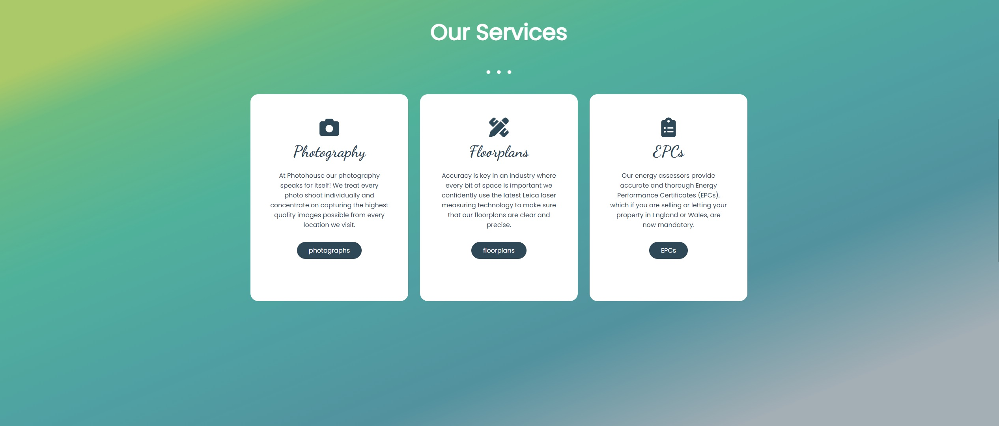
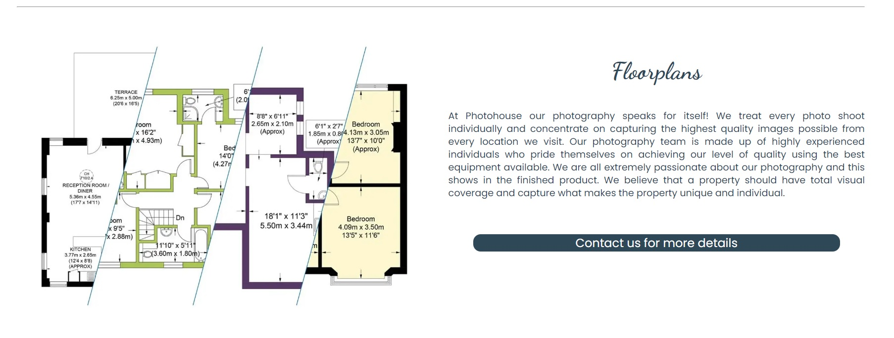

# Photohouse - HTML & CSS Website

# Introduction
This project is a Front End website for Photohouse, a marketing company based in London, England, that works with estate agents to provide photographs, floorplans and Energy Performance Certificates (EPCs) on properties they are contracted to sell or let. The main purpose of the website is to raise brand awareness, promote quality of services offered and increase the number of potential new business leads for the company. Intended users are estate agents and homeowners so UX has been designed to be create a feeling of professionalism and approachability with focus set on quality of services offered. 

The website uses HTML and CSS code only, and is interative, provides constant feedback to the user, is based on UX experience design and is fully accessible and responsive down to 280px. 

[Live Website Here](https://tonywilson1211.github.io/P1_Photohouse/)

# README Contents

* [Introduction](#introduction)
* [Existing Features](#features)
    * [Landing Page](#landing-page)
    * [Navigation Bar](#navigation-bar)
    * [About Section](#about-section)
    * [Services Section](#services-section)
    * [Gallery Section](#gallery-section)

## Existing Features

### Landing Page 

* The Landing Page is the first contact that users have with the website. A large hero image covers the user's screen and acts as a hook to intrigue the user to explore the site whilst already having an installed perception of quality. 
* It also features text used to deliver a marketing slogan to retain the users engagement and quickly provide context of what the company offers. 
[Live Page Here](https://tonywilson1211.github.io/P1_Photohouse/) 

### Navigation Bar

* At the top of the user's screen, users can find a fixed navigation bar that is fully responsive in all devices. 
* The navigation bar is fixed to the top of the screen making for easy and fast navigation of the website should the user be wanting to quickly skim the website. 
* A bold 'contact us' call to action button is located on the right side and the Photohouse logo on the left side. 
[Live Feature Here](https://tonywilson1211.github.io/P1_Photohouse/) 

### About Section

* The about section offers information on the company's main purpose, it's history and mission statement. 
[Live Feature Here](https://tonywilson1211.github.io/P1_Photohouse/index.html#about) 

### Services Section

* The services section on the home page offers a breif overview of the services provided by the company. 
* This is a quick reference point and clickable navigation links under each service takes the user to the services page where further information is provided on the product the user is monst interested in. 
* On the services page, further clickable navigation links are available that provide access to the gallery page or the contact us page. Fluidity and ease of use for UX is kept in mind here.  
[Services Section On Home Page - Live Feature Here](https://tonywilson1211.github.io/P1_Photohouse/index.html#services) 
[Services Page - Live Feature Here](https://tonywilson1211.github.io/P1_Photohouse/index.html#services) 
 

### Gallery Section

* The gallery section on the home page offers a brief overview of the type of photography provided by the company.
* Hover elements over each image draw the user to navigate to the gallery page where they will find a greater range of images.
* On the gallery page users can hover over images to increase the scale, providing a zoom-like effect.
* All photos are chosen to illustrate the quality of the service provided and fill the user with confidence on the company's ability to deliever high standards. 
[Gallery Section On Home Page - Live Feature Here](https://tonywilson1211.github.io/P1_Photohouse/index.html#gallery) 
[Gallery Page - Live Feature Here](https://tonywilson1211.github.io/P1_Photohouse/index.html#gallerypage) 
 

### Contact Us Section 

* 

[Gallery Section On Home Page - Live Feature Here](https://tonywilson1211.github.io/P1_Photohouse/index.html#contact-us-container) 
[Gallery Page - Live Feature Here](https://tonywilson1211.github.io/P1_Photohouse/index.html#contactUs) 
 

### Footer Section

* This feature is called the Footer Section. Here users can see information about the company's schedule and contact Travel World through the social media links. The copyright message is displayed on the bottom. 
[Live Feature Here](https://pedrocristo.github.io/portfolio_project_1/home.html#footer)

### Contact Page

* In this page users can contact the Travel World via a contact form. The contact form requires the user's first name, last name, email and message. The user can also see the location of the Travel World office on Google Maps. 
[Live Feature Here](https://pedrocristo.github.io/portfolio_project_1/contact.html)

### Thanks Page

* Once the user successfully submits a contact form, they will land on the 'Thanks' Page. When the button is clicked it brings the users back to the contact form. 
[Live Feature Here](https://pedrocristo.github.io/portfolio_project_1/thanks-page.html)

## Future Features
  
### Customer Review Section

* Add a Customer Review Section in the Home page. This would allow users to offer suggestions on how to improve the website and display customers' experiences and their opinions of Travel World.

* [User Experience UX](#user-experience---UX)
    * [User stories](#user-stories)
* [Design](#Design)
        
    * [Website Structure](#website-structure)
    * [Colour Scheme](#colour-scheme)
    * [Typography](#typography)
    * [Imagery](#imagery)
    * [Videos](#videos)
    * [Google Maps](#google-maps)
    * [interactive Links](#interactive-links) 
* [Features](#features)  
    * [Landing Page](#landing-page) 
    * [Home Page Header](#home-age-eader)
    * [About Section](#about-section)
    * [Banner Section 1 - Bali](#banner-section-1---bali) 
    * [Top Trips Section](#top-trips-section)
    * [Banner Section 2 - Maldives](#banner-section-2---maldives)
    * [City Breaks Section](#city-breaks-section)
    * [Partners Section](#partners-section)
    * [Footer Section](#footer-section)
    * [Contact Page](#Contact-page)
    * [Thanks Page](#thanks-page)
* [Future Features](#future-features)
    * [Customer Review Section](#customer-review-section)
* [Technologies Used](#technologies-used)
    * [Languages Used](#languages-used)
    * [Frameworks - Libraries - Programs Used](#frameworks---libraries---programs-used)
* [Testing](#testing)
    * [Bugs](#bugs)
    * [Website Development Issues](#website-development-issues)
* [Deployment](#deployment-this-project)
    * [Deployment This Project](#deployment-this-project)
    * [Forking This Project](#forking-this-project)
    * [Cloning This Project](#cloning-this-project)
* [Credits](#credits)
* [Content](#content)

## User Experience - UX

 ### User Stories

* As a website creator, I want to:
  
1. Build a website that is visually appealing from the user’s first visit so they are intrigued to explore all the pages.
2. Build an easy to navigate website for its users.
   
* As a new visitor, I want to:

1. Understand the main purpose of the site.
2. Be able to easily navigate throughout the site and find relevant content about package holidays.
3. Be able to easily contact the company for more information.
   
* As a returning visitor, I want to:

1. Be able to find newly available package holidays.
2. Be able to find more relevant information about the company.
   
## Design

### Website Structure
Travel World website is a four pages site: Landing Page, Home Page, Contact Page and Thanks Page. The default loading page is the Landing Page and it is linked to the Home Page by a button. The Home Page has 8 sections: (1) Trust, (2) About, (3) Banner Bali, (4) Top Trips, (5) Banner Maldives, (6) City Breaks, (7) Partners and Footer. This page, is linked to all the pages in the website by the Navigation Menu on the top. The Contact Page has the Menu at the top and 3 sections: (1) Contact Form, (2) Partners (3) Footer. The Thanks Page has two sections: (1) 'Thanks' message and (2) Footer.

#### Colour Scheme
 
 There are four main colours used: (1 ) white (#ffffff), (2) a variation of white (#faebd7), (3) an orange tone (#f84f0d) and (4) a black (#111111). The white is used for the main website background, the black is used for text while the orange represents a colour tone that can be seen in the logo, titles and icons. When the user hovers, the white variation (#faebd7) is used for the button background.
 In the Footer Section I used a linear gradient as background using four main colours and orientation of 258 degrees.

#### Typography
* The Poppins , sans-serif is used as the main font for the whole website.
* The El Messiri, sans-serif is used to display the hotel's name on the cards.
         
#### Imagery
* 3 background images one in the Header and another 2 in the Banner Section.
* 6 Images for the icons in the Trust Section with the size of 48px by 48px. They are PNG files.
* 2 images in the About Section with the size of 680px by 410px.
* 12 images for the Top Trips Section and City Break Section with the size of 950px by 713px.
* 8 Images in the Partners Section with the size of 580px by 280px.
* 1 image GiF animation in the Thanks Page.
* Please Note (All images were converted to the webp files except the 6 images in the Trust Section).

###  Videos
* The Landing Page has one video as a background displaying muted, loop and autoplay.

### Google Maps
* The web site has a Google Maps location section where the users can locate the office in Dublin.

### Interactive Links  

* At the bottom of the Landing Page and footer, users can access the company social media links (Facebook and Twitter). Once these icons are clicked they are opened in a new tab. 
* In the Banner Bali and Banner Maldives the user can directly telephone the company by clicking the 'book now' button.

## Technologies Used

### Languages Used 

* [HTML5](https://en.wikipedia.org/wiki/HTML5).
* [CSS3](https://en.wikipedia.org/wiki/Cascading_Style_Sheets).
* [Bootstrap](https://getbootstrap.com/).

### Frameworks - Libraries - Programs Used

* [Google Fonts:](https://fonts.google.com/)
   * Google fonts were used to import the 'Poppins' and 'El Messiri' fonts throughout the style.css.
* [Font Awesome:](https://fontawesome.com/)
    * Font Awesome are used as an icons for user UX purposes.
* [Git](https://git-scm.com/)
    * Git was used for version control by utilizing the Gitpod terminal to commit to Git and Push to GitHub.
* [GitHub:](https://github.com/)
    * GitHub is used to store the project's code after being pushed from Git.
* [PIXLR:](https://pixlr.com/pt/)
    * PIXLR was used to create, modify and resize all images on this website.
* [Canva](https://www)
    * Canva was used to creat the image logo, favicon and also the office image.
  
## Testing

The W3C Markup Validator and W3C CSS Validator Services were used to validate every page of the project to ensure there were no syntax errors in the project.

* [W3C Markup Validator](https://validator.w3.org/#validate_by_input) - [Website Results](https://validator.w3.org/nu/?doc=https%3A%2F%2Fpedrocristo.github.io%2Fportfolio_project_1%2Findex.html)
* [W3C CSS Validator](https://jigsaw.w3.org/css-validator/#validate_by_input) - [Website Results](https://jigsaw.w3.org/css-validator/validator?uri=https%3A%2F%2Fpedrocristo.github.io%2Fportfolio_project_1%2Findex.html&profile=css3svg&usermedium=all&warning=1&vextwarning=&lang=en).

Google Lighthouse was used to test Performance, Best Practices, Accessibility and SEO on both Desktop and Mobile devices.

The testing was done using the Google Chrome Browser. Chrome Developer Tools was used extensively, particularly to check responsiveness on different screen sizes. Testing was also done using Firefox on desktop, and again on Google Chrome and Opera on the Huawei P20.

* Responsive on all device sizes between 280px - 2600px wide

* Devices tested using the Google Developer Tools emulator

    * BlackBerry Z30 (360px x 640px)  
    * BlackBerry PlayBook (600px x 1024px)  
    * Samsung Galaxy Note 3 (360px x 640px) 
    * Samsung Galaxy S3 (360px x 640px)   
    * Samsung Galaxy S9+(320px x 658px) 
    * LG Optimus L70 (384px x 640px)
    * Microsoft Lumia 550 (640px x 360px) 
    * Microsoft Lumia 950 (360px x 640px) 
    * Nexus 4 (384px x 640px) 
    * Nokia Lumia 520 (320px x 533px) 
    * Nokia N9 (480px x 854px) 
    * Pixel 3 (393px x 786px)
    * Apple iPad Mini (468px x 4024)
    * Apple iPhone 4 (320px x 480px)
    * Apple iPhone 5/S (320px 568px)
    * Apple iPhone 6/7/8 (375px x 667px)
    * Apple iPhone 6/7/8 Plus (414px x 736px)
    * Apple iPhone X (375px x 812px)

* Desktop Results:

  .

* Mobile Results:

  .

   ## Functionality
* All links have been hovered and clicked to ensure accessibility.
* Pages all load correctly on all device screen sizes.
* All social media links work correctly and open on a new tab.
* All images load on each page as intended.
* All the buttons are working correctly and bring the users to the function that they were built for.
* The arrows inside the buttons in Landing Page, Thanks Page and Homepage banners, has a fully functional opacity animation.
* Both the buttons in Homepage cards and in the Contact Page change the background and text color when hovered by the user. They are working without issues.
* The cards in the Homepage "top trips", change the box shadow when hovered by the user, working correctly.
* The cards in the Homepage "city breaks", has an image zoom in effect when hovered by the users, working correctly.

   ## Bugs

* I was unable to add padding to the arrow default in the form select.

   ## Website Development Issues

* At the initial stages of my project, I made an error when using Git Commit. Following my first call with my mentor he clarified how to do it and I have followed his recommended approach.

## Deployment of This Project

The website development was created in the "main" branch. This branch was deployed using GitHub Pages.

* This site was deployed by completing the following steps:

1. Open [GitHub](https://github.com/).
2. Click on the project to be deployed.
3. Navigate to the "Settings".
4. Navigate down to the "GitHub Pages".
5. Click on "Check it out here!".
6. Select the "main" branch and select "Save".
7. The link to the live website was ready on the top.

## Forking This Project

* Fork this project following the steps:

1. Open [GitHub](https://github.com/).
2. Click on the project to be forked.
3. Find the 'Fork' button to the top right of the page.
4. Once you click the button the fork will be in your repository..

## Cloning This Project

* Clone this project following the steps:

1. Open [GitHub](https://github.com/).
2. Click on the project to be cloned.
3. You will be provided with three options to choose from, HTTPS, SSH or GitHub CLI, click the clipboard icon in order to copy the URL..
4. Once you click the button the fork will be in your repository.
5. Open a new terminal.
6. Change the current working directory to the location that you want the cloned directory.
7. Type 'git clone' and paste the URL copied in step 3.
8. Press 'Enter' and the project is cloned.

## Credits

### Information Sources/Resources

* [W3Schools](https://www.w3schools.com/).

* [Stack Overflow](https://stackoverflow.com/).
  

## Content

* All the text content is original. The quote in the footer is from [Andre Gide](https://www.brainyquote.com/quotes/andre_gide_120088).

### Images

* All images were provided and used under the Unsplash licence [Unsplash.com](https://unsplash.com/license).

### Video

* The video was provided and used under the Pexels licence [Unsplash.com](https://www.pexels.com/video/aerial-view-of-an-infinity-pool-in-maldives-beach-resorts-4069480/).

### Trust Section Icons

* All the icons were provided and used under the Icons8 licence [Icons8.com](https://icons8.com/icons/set/best-price).
  
## Special Thanks

 * Special thanks to my mentor Sandeep Aggarwal, my colleagues at Code Institute, Kasia Bogucka and Mairéad Gillic for their assistance throughout this project.
